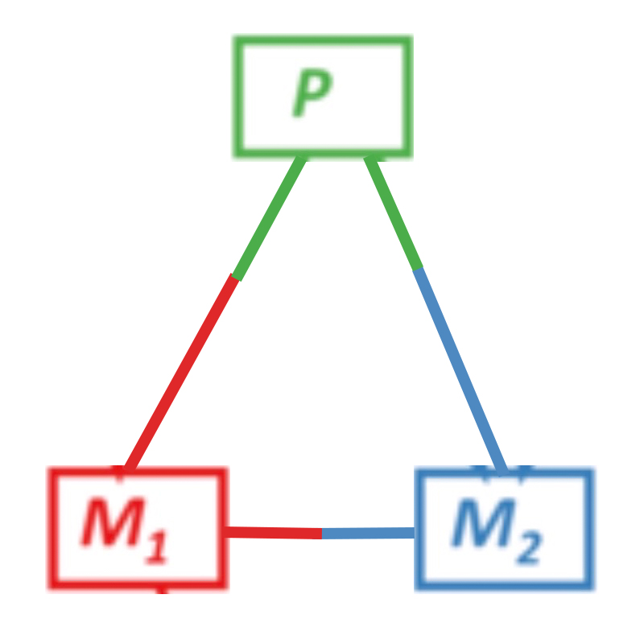

# </img> MACH2-Viz
[](https://zenodo.org/doi/10.5281/zenodo.10162326)

MACH2 is an upgraded version of [MACHINA](https://github.com/raphael-group/machina), [(El-Kebir et. al.)](https://www.nature.com/articles/s41588-018-0106-z). MACH2-Viz visualizes the solution space for algorithms running the parsimonious migration history problem with polytomy resolution. Solutions are generated via MACH2 (Roddur et. al.). MACH2-Viz also supports data from MACHINA or any cancer migration history inference software as long as the data can be compiled into valid JSON format for MACH2-Viz to parse.

## Current Deployed Version

To view the current deployment of MACH2Viz, go to [this link](https://elkebir-group.github.io/mach2-viz/#/)

## Running MACH2-Viz on Localhost

To run MACH2-Viz on localhost, simply do the following:  

1. Clone this repository
2. Run `npm install`
3. Run `npm start`  
  a. **NOTE:** You may run into dependency issues with OpenSSL  
  b. in which case simply run `export NODE_OPTIONS=--openssl-legacy-provider` and try again

## Documentation

To view documentation for using MACH2-Viz, refer to [this link](docs/documentation.md)

## Contributing

If you have a dataset that you would like to add to our gallery, follow these steps:

1. Create a [fork](https://github.com/elkebir-group/MACH2/fork) of this repository
2. Run [MACH2](https://github.com/elkebir-group/MACH2) and get a JSON
3. Put your JSON in `src/samples` within your fork
4. Add an entry to `src/samples/mapping.json`.
   1. `"name"` and `"dataset"` can be arbitrarily named (but make it appropriate for the dataset).
   2. `"path"` must be the path to the json relative to the `samples/` directory.

```json
{
  "name": "patient_name",
  "dataset": "dataset_name",
  "path": "path"
}
```