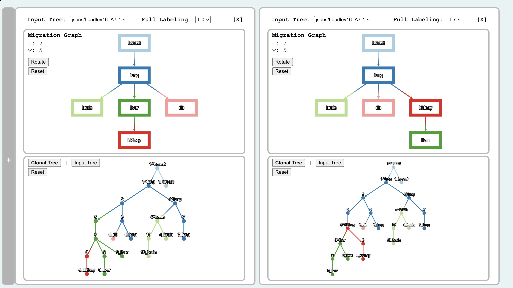
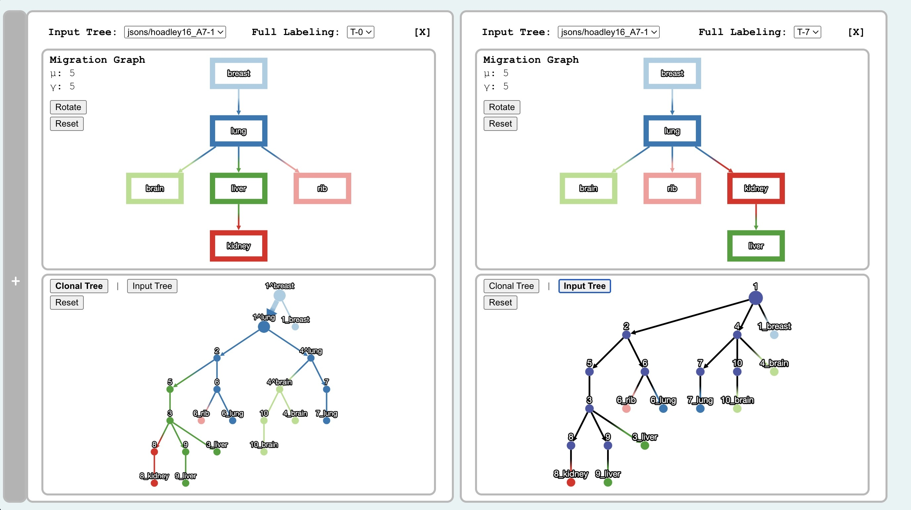

# Comparing Solutions

When you open up a dual viz by opening up a viz screen and clickingg the `+` on the right, you will see the following.

*NOTE: You will initially see two panels with the same solution showing, I had toggled the right-side visualization to get this result.*

## Basic Features of the Dual-Panel Visualization

All features from the single panel view are per panel in the dual panel view as well. You can switch between solutions and (if the data contains it) input trees. You can drag and alter the viewports, toggle between the input and output trees as well.
  
Moreover, if a node or edge in one panel is hovered over, the corresponding labels and node_ids will hover in the second panel.
  
To exit this view, simply click on the `X` button on one of the panels and that panel will close out. To view the summary graph along with both of these panels, click the `+` on the left.

## Polytomy Refinement Visualization

If your data has an input tree(s), as well as origin node mappings, they will be reflected in this feature of the visualization. To visualize polytomy mappings:

- Have two panels containing solutions with the same input tree open.
- In one of the panels, toggle to the input tree
- When you hover over a node in the input tree, the corresponding nodes resulting from a polytomy refinement will highlight in the other panel.
- See the figure below:

*In this figure, I have my mouse hovering over the tree node labeled `1` on the right. We can see that in the panel on the left, the `1^breast` and `1^lung` nodes as well as the edge between them are highlighted.*