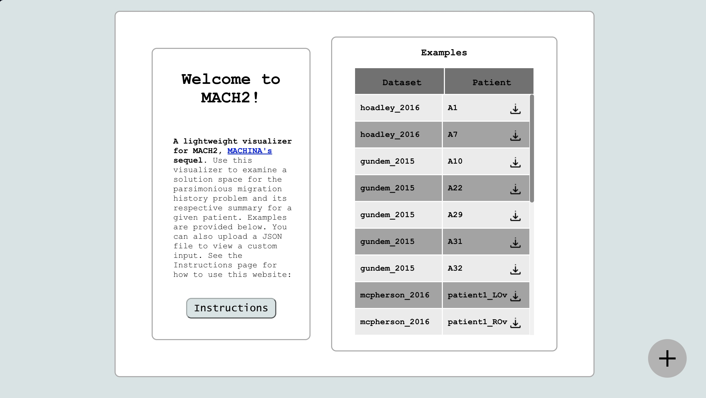

# Loading Data

- [Loading Data](#loading-data)
  - [Loading an Example JSON](#loading-an-example-json)
  - [Uploading your own JSON](#uploading-your-own-json)
  - [Dataset Sources](#dataset-sources)

When you first open the visualizer, you will see the following homepage.

*The homepage of MACH2-Viz. You can view instructions for using the app, view example solutions, or upload your own solutions via the `+` icon.*

## Loading an Example JSON

You can select one of the example datasets to visualize from the table on the right-hand side. On the `Dataset` column, you will see the source of the sample dataset. You can see the sources of the datasets in the bottom of this page.
  
You can click on an entry of the table to load up one of the examples.
  
**NOTE: If a dataset has more than 100 solutions, it may be a bit laggy**.

## Uploading your own JSON

Click on the `+` icon at the bottom-right of the page to upload your own JSON. To see documentation on how to write a valid JSON for Mach2-Viz, see this [link](data.md).

## Dataset Sources

- `hoadley_2016`:
  > *Hoadley KA, Siegel MB, Kanchi KL, Miller CA, Ding L, Zhao W, He X, Parker JS, Wendl MC, Fulton RS, Demeter RT, Wilson RK, Carey LA, Perou CM, Mardis ER. Tumor Evolution in Two Patients with Basal-like Breast Cancer: A Retrospective Genomics Study of Multiple Metastases. PLoS Med. 2016 Dec 6;13(12):e1002174. doi: 10.1371/journal.pmed.1002174. Erratum in: PLoS Med. 2017 Jan 9;14 (1):e1002222. PMID: 27923045; PMCID: PMC5140046.*
- `gundem_2015`:
  > *Gundem G, Van Loo P, Kremeyer B, Alexandrov LB, Tubio JMC, Papaemmanuil E, Brewer DS, Kallio HML, Högnäs G, Annala M, Kivinummi K, Goody V, Latimer C, O'Meara S, Dawson KJ, Isaacs W, Emmert-Buck MR, Nykter M, Foster C, Kote-Jarai Z, Easton D, Whitaker HC; ICGC Prostate Group; Neal DE, Cooper CS, Eeles RA, Visakorpi T, Campbell PJ, McDermott U, Wedge DC, Bova GS. The evolutionary history of lethal metastatic prostate cancer. Nature. 2015 Apr 16;520(7547):353-357. doi: 10.1038/nature14347. Epub 2015 Apr 1. Erratum in: Nature. 2020 Aug;584(7820):E18. PMID: 25830880; PMCID: PMC4413032.*
- `mcpherson_2016`:
  > *McPherson A, Roth A, Laks E, Masud T, Bashashati A, Zhang AW, Ha G, Biele J, Yap D, Wan A, Prentice LM, Khattra J, Smith MA, Nielsen CB, Mullaly SC, Kalloger S, Karnezis A, Shumansky K, Siu C, Rosner J, Chan HL, Ho J, Melnyk N, Senz J, Yang W, Moore R, Mungall AJ, Marra MA, Bouchard-Côté A, Gilks CB, Huntsman DG, McAlpine JN, Aparicio S, Shah SP. Divergent modes of clonal spread and intraperitoneal mixing in high-grade serous ovarian cancer. Nat Genet. 2016 Jul;48(7):758-67. doi: 10.1038/ng.3573. Epub 2016 May 16. PMID: 27182968.*
- `tracerx`:
  > *“Tracking genomic cancer evolution for precision medicine: the lung TRACERx study”, PLoS Biol. July 2014; 12(7):e1001906.*
  