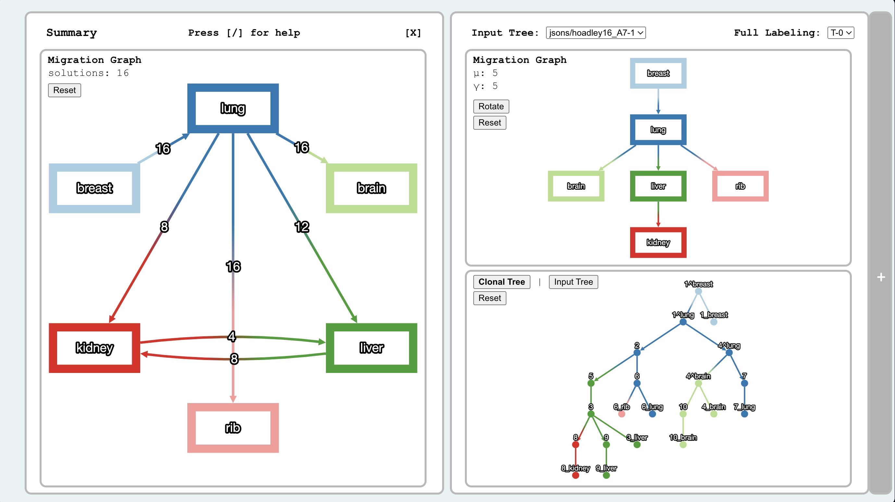
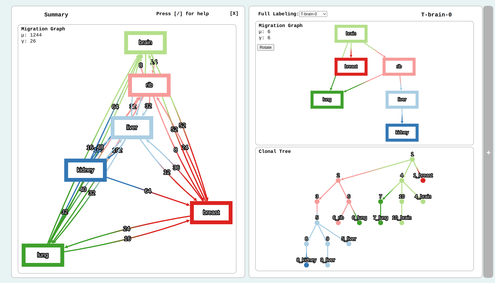
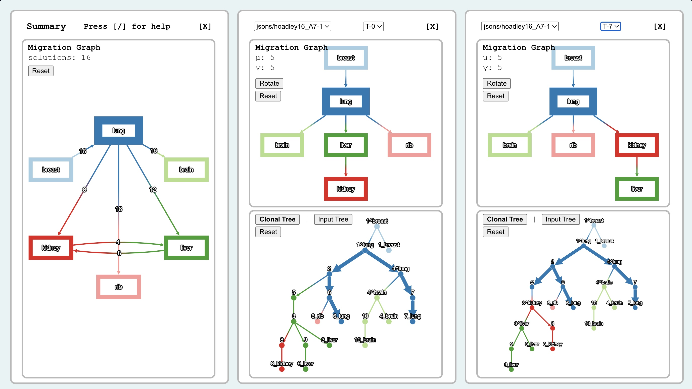
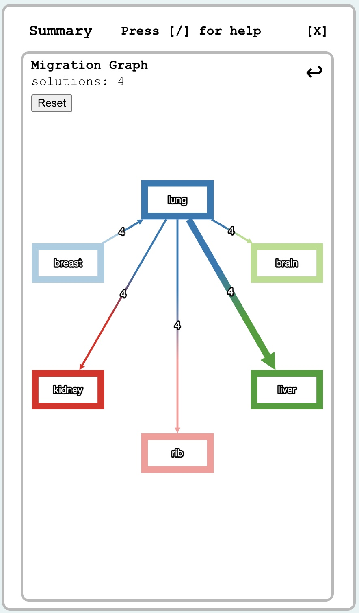
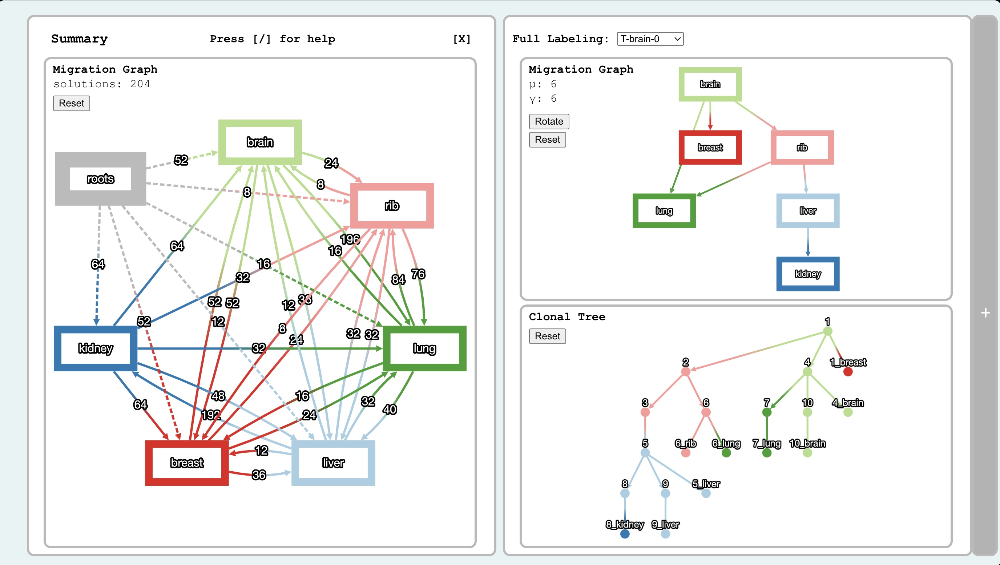

# Summary View

- [Summary View](#summary-view)
  - [Basic Functionality](#basic-functionality)
    - [The Summary Graph](#the-summary-graph)
  - [Constraining the Solution Space](#constraining-the-solution-space)
  - [Multi-rooted data](#multi-rooted-data)

When you open up a sumary panel by clicking the `+` bar on the left from either a single or dual panel viz, you will see one of the screens below:

*Summary panel views in MACH2-Viz. To enter the three panel view (bottom) from the dual summary panel view (top). Simply click the `+` bar in the right.*

## Basic Functionality

You can perform the single and double panel functions as normal with the solution solution panel(s) in the right.
  
### The Summary Graph

The summary graph is a collection of all solutions' migration graphs unioned into a single graph. Each edge is a migration that exists somewhere in the provided solution space, and each edge is weighted by the number of solutions the migration appears in.
  
In the top left corner of the summary graph panel, you will see the number of available solutions. Any edit on the graph can be reset using the `reset` button.
  
You can hover over nodes and edges in the summary graph and see highlighting correspondence in the individual solutions in the panel(s) on the right. Vice versa, if you hover over nodes and edges in the individual solutions, you will see highlighting correspondence in the summary graph.

*My mouse is hovering over the `lung` node in the summary graph. The corresponding nodes and edges are highlighting on the right side as well.*

## Constraining the Solution Space

Suppose, due to some clinical data, we are certain that a migration from `lung` to `liver` occured, but we are also certain that a migration from `kidney` to `liver` couldn't have happened. To address this, we need to require an edge and delete an edge from the summary graph.

- **To require an edge** simply click on that edge in the summary graph. We will then click on `lung->liver`.
  - **To unrequire an edge** either click on the edge again, or hit the undo arrow on the top right corner of the summary panel.
- **To delete an edge** hold down the shift key so that the cursor changes  and click on that edge in the summary graph. We will then shift-click `kidney->liver`.
  
Notice how the solutions on the right are only selectable between the remaining set after the constraints have been set. Moreover, the solutions number on the top left of the summary panel is set to the number of remaining solutions.

<!-- markdownlint-disable -->
</img>
<!-- markdownlint-ensable -->

*The constrained graph after requiring `lung->liver` and deleting `kidney->liver`. Note that there are only 4 solutions left. To undo any changes, either `reset` or click the undo arrow on the top right.*

## Multi-rooted data

If your solution space has multiple possible roots across all clonal trees, your summary graph will look like the following

*Multiple roots exist in this dataset, hence the `roots` node in the summary graph.*

The `roots` node points to any node such that it exists as a root of a clone tree somewhere in the solution space. That way, we introduce some more functionality.

- **Requiring a root**: To get all solutions such that only a single selected node roots the trees in the solution space, simply click on the edge going from `roots` to that node.
- **Deleting a root:** To get the complement of the above constraint, the dataset such that any node but the selected one roots clonal trees in the solution space, simply shift-click the same edge.
- **ex.** If I only want solutions such that the brain is the primary tumor (eg. the root) then I will just click on `roots->brain` above.