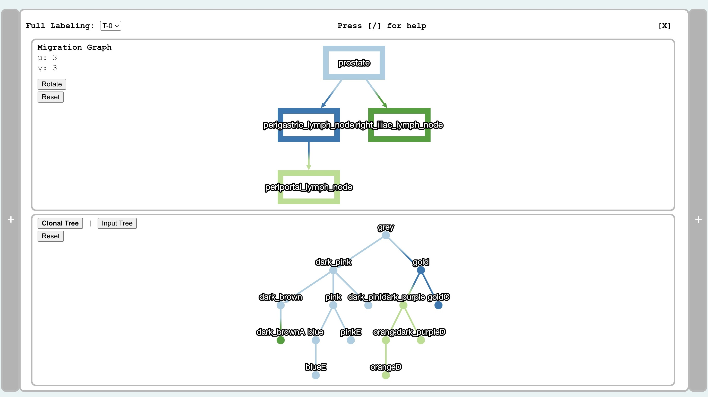
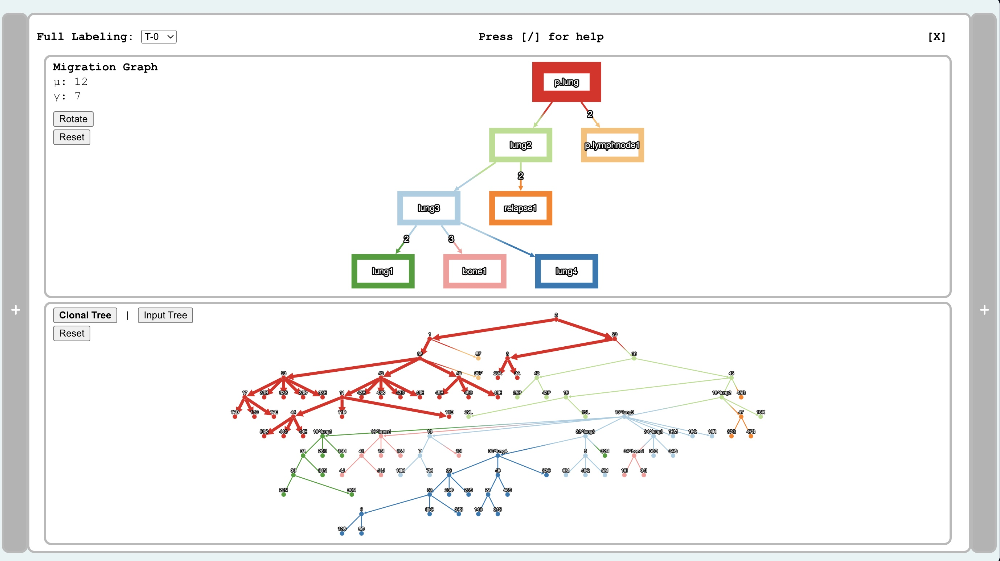
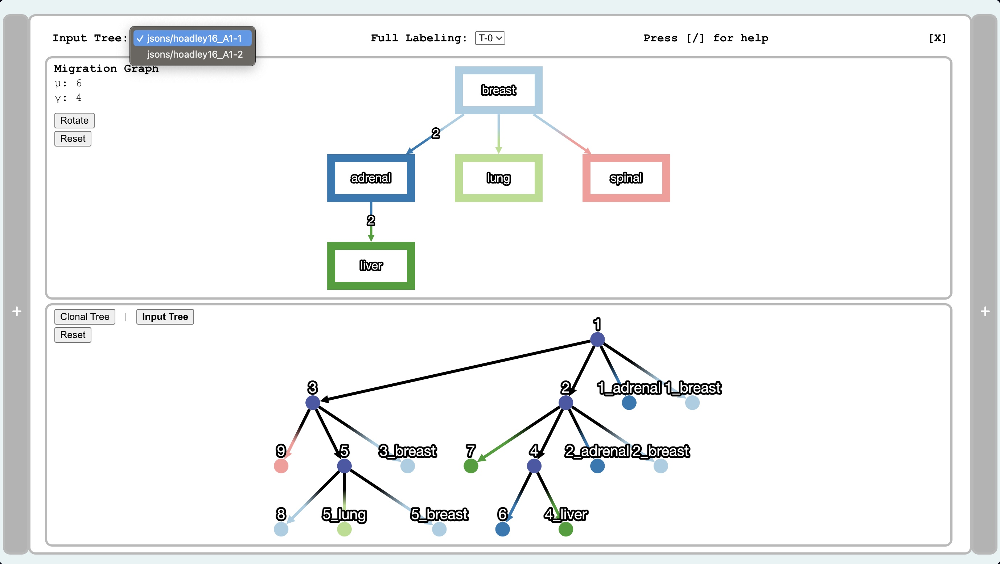

# Navigating the Visualizer

When you first open the visualizer, you will see a layout that looks like the following:

*The basic viz view of MACH2-Viz. Both a clone tree and its corresponding migration graph will display. View more functionality below.*

## Basic Functions

- **View migration and comigration numbers**. In the top left corner of the migration graph panel, you will see the calculated migration and comigration numbers:
  - $\mu$: The migration number, the total number of migration events.
  - $\gamma$: The number of unique migrations, where uniqueness is given by the anatomical locations at which the migration is happening.
- **Toggle the solutions** with the dropdown menu in the top left.
- **Zoom, pan, and drag nodes** in both the tree and migration graph.
- **Hover corresponding nodes and edges**. When you hover over a node or edge in the migration graph, the corresponding edges in the clonal tree will highlight as well. Likewise vice versa.
  - If a node in the migration graph is hovered, all mutations within the hovered location will highlight.
  - If an edge in the migration graph is hovered, all edes between tumor locations will highlight in the clone tree.
  - The same correspondence exists vice versa if a clone tree edge or node is highlighted.
- **Compare solutions** by opening up another visualizer window. This can be done by clicking the `+` bar on the right.
- **View the summary panel**. To view a summary graph of all solutions, click the `+` bar on the left.
- Though self-explanatory, you can rotate the migration graph, and reset the view if any changes were made on the view (panning, dragging, or dilation). For more information, press the `/` key for a help popup.

*Hover function in the viz. My mouse is hovering over the `p.lung` node in the migration graph.*

## Data-Dependent Functions

- **If you have an input tree in your data**
  - There will be an `input tree` button like in the example above. This will let you toggle between the input tree and the solution tree.
- **If you have multiple input trees**
  - You will also be able to select between input trees in the dropdown menu in the top of the window, just like you can in selection between solutions. See the example below.

*A viz panel for a dataset with multiple input trees. There is a dropdown for input trees on the top  left, and the unlabeled input tree is displayed on the bottom panel.*
